<picture>
  <source media="(prefers-color-scheme: dark)" srcset="dark.svg">
  <source media="(prefers-color-scheme: light)" srcset="light.svg">
  
</picture>

  

### About Me

I'm a Computer Science graduate (Cybersecurity track) based in Riyadh, Saudi Arabia, focused on Blue Team / SOC Analyst work. I like turning raw logs and alerts into clear, actionable detections — and I build small tools to speed that process up.

**Certifications:** CompTIA Security+ · ISC2 CC · Splunk Core Certified User · Fortinet FCF & FCA · NSE 4 (in progress)

**Frameworks I work with:** MITRE ATT&CK · NIST CSF · NIST SP 800-61 · ISO/IEC 27001 · NCA ECC · SAMA CSF · Cyber Kill Chain

---

### 🛠️ Featured Projects

**[Splunk SOC Lab](https://github.com/omarElHajj03/Splunk-soc-lab)**
A home-built SOC lab with Sysmon log ingestion, 11,000+ indexed events, five MITRE ATT&CK-mapped detection rules, three dashboards, and a full incident report.

**PhishTriage**
A Python phishing email triage tool — extracts IOCs, enriches them via VirusTotal and AbuseIPDB, applies weighted scoring, and generates a Markdown report.

---

### 📫 Reach Me

- Email: omarwaelelhajj@gmail.com
- LinkedIn: [linkedin.com/in/omar-el-hajj-66b540219](https://www.linkedin.com/in/omar-el-hajj-66b540219/)
